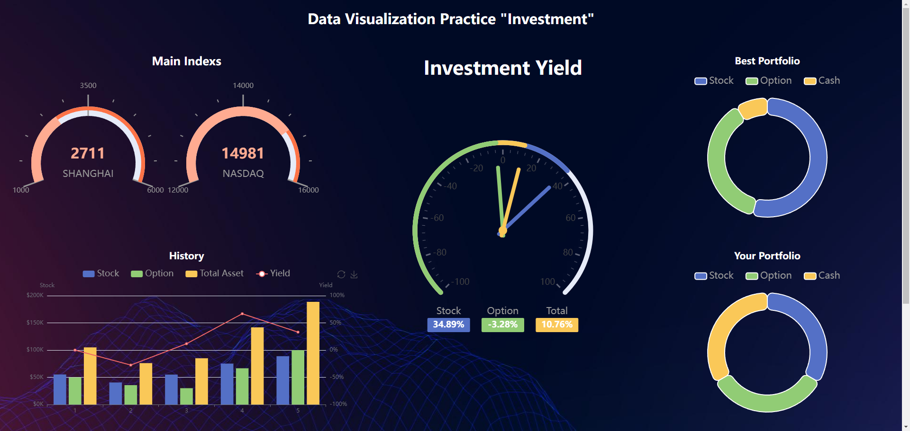

# Investment_vis
A project to practice Data Visualization.


## Preparation
- Node.js
- Go
- MySQL
- Nginx

## Run
- To run the frontend project (Vue)
  ```
  cd ./myapp
  npm run serve
  ```
- To run the backend project (Go + MySQL)
  ```
  cd ./server
  go mod tidy
  go run server ./conf/config.yaml
  ```
## Data
The purpose of this project is to visualize some investment data. However, the data used is "fake" because I could not find stable and free API to attain real data. 

In these five charts, four of them are dynamic (Main indexs, Investment yield, Best Portfolio, Your Portofolio). They request the latest data from the backend every 2 seconds.

The descriptions for each graph are the following:

### Main Indexs
This chart shows two imoprtant stock indexs in China and the US. 

### History
This chart illustrates the performance of your investment portfolio over the past five weeks. The bar graph represents the value of stocks, options, and total assets at the end of each week, while the line graph shows the week-over-week total return rate compared to the previous week.

### Investment yield
This chart displays the real-time investment return rates compared to the previous week.

### Best Portfolio & Your Portfolio
These two charts respectively illustrate the investment portfolios of the individual currently ranked first in terms of return rate and your current investment portfolio.

## Deploy
This project was deployed on Cloud server through Nginx. The config file for Nginx is in "others" directory.

- The compiled project is in the data_vis file. You can use it to deploy or test.

## Results
The project should looks like this (1920 * 911):
